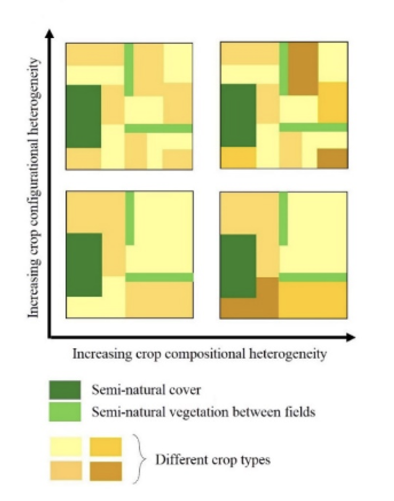

```{r setup, include=FALSE}
knitr::opts_chunk$set(message=FALSE,warning=FALSE, cache=TRUE)
```

IMPORTANT: Here I will update studies that I may carry out during my PhD at ASE-NTU 

17 | 09 | 2020 Last compiled: `r Sys.Date()`

# Socio-Economic Factors Affecting Crop Heterogeneity 

Crop heterogeneity may be particularly important in situations where patches of semi-natural/natural vegetation are too small to support viable population sizes of species. They are also a component of the agricultural landscape that can be shaped by policy, and it has been argued that cropping systems may be beneficial to local economics, as well as the environment. Hence, increasing crop heterogeneity could be a way in which to both positively affect crop production (and farmers' livelihoods) and biodiversity conservation. However, for farmers to be able to adapt their farmlands for biodiversity-friendly farming, they will need to have the confidence that such approaches are also economically efficient.

As farmers’ interest and attitudes significantly influence the decision-making process on what to plant and how to manage both crops and non-crop areas, integrating socio-economic factors is essential to develop sound management options, as well as to understand agroecosystems itself. This project is designed to incorporate the major socio-economic factors that influence heterogeneous agroecosystems, which is rarely done in agricultural studies.

Aim: The main aim of this project is the synthesis of knowledge and the application of scientific findings for future management. Outcomes from the analysis will advance scientific understanding of agroecosystems and help construct more effective policies that ensure sustainable agricultural landscapes.


### Study 1: Farmland heterogeneity to reduce the agricultural risks 


#### Highlights

- The effect of crop heterogeneity (i.e. crop compositional and configurational heterogeneity) on production (yield and price), pest activities, and agrochemical usage will be tested. 

- Crop heterogeneity effects on farmers’ profit margin will be tested. 

- Crop heterogeneity effects on contract farming will be tested.

#### Description 

Crop heterogeneity can be seen as having two key components: (i) crop compositional heterogeneity (the number and evenness of crop types) and (ii) crop configurational heterogeneity (spatial arrangement of crop fields, Fahrig et al., 2011).


</a>
</div>

# Adding R stuff

So far this is just a blog where you can write in plain text and serve your writing to a webpage. One of the main purposes of this lab journal is to record your progress learning R. The reason I am asking you to use this process is because you can both make a website, and a lab journal, and learn R all in R-studio. This makes everything really convenient and in the sam place. 

So, let's say you are learning how to make a histogram in R. For example, maybe you want to sample 100 numbers from a normal distribution with mean = 0, and standard deviation =1, and then you want to plot a histogram. You can do this right here by using an r code block, like this:

```{r}
samples <- rnorm(100, mean=0, sd=1)
hist(samples)
```

When you knit this R Markdown document, you will see that the histogram is printed to the page, along with the R code. This document can be set up to hide the R code in the webpage, just delete the comment (hashtag), from the cold folding option in the yaml header up top. For purposes of letting yourself see the code, and me see the code, best to keep it the way that it is. You learn all of these things and more can be customized in each R code block.

# The big idea

Use this lab journal to record what you do in R. This way I will be able to see what you are doing and help you along the way. You will also be creating a repository of all the things you do. You can make posts about everything. Learning specific things in R (project unrelated), and doing things for the project that we will discuss at the beginning of the Fall semester. You can get started now by fiddling around with googling things, and trying stuff out in R. I've placed some helpful starting links in the links page on this website

# What can you do right now by yourself?

It's hard to learn programming when you don't have specific problems that you are trying to solve. Everything just seems abstract.

I wrote an [introductory programming book that introduces R](https://crumplab.github.io/programmingforpsych/), and gives some [concrete problems for you to solve](https://crumplab.github.io/programmingforpsych/programming-challenges-i-learning-the-fundamentals.html). 

To get the hang of journaling and solving the problems to learn programming, my suggestion is that you use this .Rmd file to solve the problems. It would look like this:

# Problem 1

Do simple math with numbers, addition, subtraction, multiplication, division

```{r}
1+2
2*5
5/3
(1+6+4)/5

```

# Problem 2

Put numbers into variables, do simple math on the variables

```{r}
a<-1
b<-2
a+b

d<-c(1,2,3)
e<-c(5,6,7)
d+e
d*e
d/e

```

# Problem 3

Write code that will place the numbers 1 to 100 separately into a variable using for loop. Then, again using the seq function.

```{r}
# for loop solution
# i becomes the number 1 to 100 at each step of the loop


a <- length(100) # make empty variable, set length to 100
for (i in 1:100){
  a[i] <-i #assigns the number in i, to the ith index of a
}

print(a)

# for loop solution #2

a<-c() #create empty variable using combine command
for (i in 1:100){
  a<-c(a,i) # keeps combining a with itself and the new number in i
}
print(a)

# seq solution
a <- seq(1,100,1) # look up help for seq using ?seq() in console
print(a)

```

# Replace this with problem 4

And keep going. Try to solve the problems with different scripts that provide the same solution. Good luck, Happy coding.
