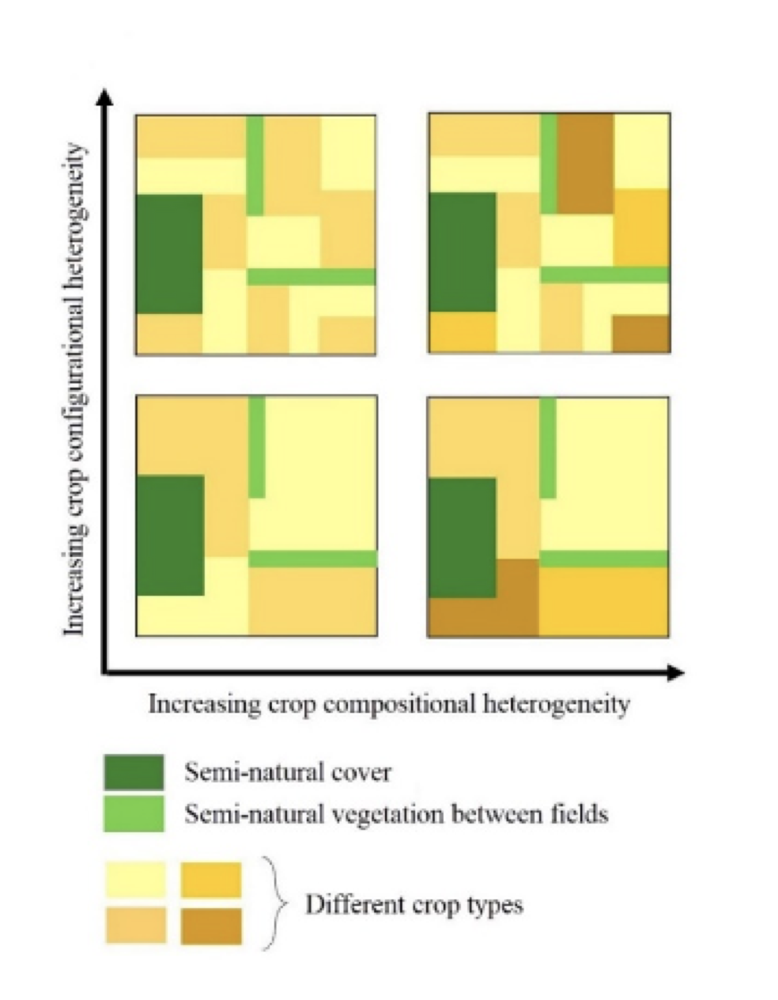

```{r setup, include=FALSE}
knitr::opts_chunk$set(message=FALSE,warning=FALSE, cache=TRUE)
```

IMPORTANT: Here I will update studies that I may carry out during my PhD at ASE-NTU 

17 | 09 | 2020 Last compiled: `r Sys.Date()`

## Socio-Economic Factors Affecting Crop Heterogeneity 

Crop heterogeneity may be particularly important in situations where patches of semi-natural/natural vegetation are too small to support viable population sizes of species. They are also a component of the agricultural landscape that can be shaped by policy, and it has been argued that cropping systems may be beneficial to local economics, as well as the environment. Hence, increasing crop heterogeneity could be a way in which to both positively affect crop production (and farmers' livelihoods) and biodiversity conservation. However, for farmers to be able to adapt their farmlands for biodiversity-friendly farming, they will need to have the confidence that such approaches are also economically efficient.

As farmers’ interest and attitudes significantly influence the decision-making process on what to plant and how to manage both crops and non-crop areas, integrating socio-economic factors is essential to develop sound management options, as well as to understand agroecosystems itself. This project is designed to incorporate the major socio-economic factors that influence heterogeneous agroecosystems, which is rarely done in agricultural studies.

Aim: The main aim of this project is the synthesis of knowledge and the application of scientific findings for future management. Outcomes from the analysis will advance scientific understanding of agroecosystems and help construct more effective policies that ensure sustainable agricultural landscapes that work for both biodiversity and people.


### Study 1: Farmland heterogeneity to reduce the agricultural risks 


#### Highlights

- The effect of crop heterogeneity (i.e. crop compositional and configurational heterogeneity) on production (yield and price), pest activities, and agrochemical usage will be tested. 

- Crop heterogeneity effects on farmers’ profit margin will be tested. 

- Crop heterogeneity effects on contract farming will be tested.

#### Description 

Crop heterogeneity can be seen as having two key components: (i) crop compositional heterogeneity (the number and evenness of crop types) and (ii) crop configurational heterogeneity (spatial arrangement of crop fields, Fahrig et al., 2011).

Heterogeneity of farmlands that the farmer produces may be an effective way to help farmers deal with several types of agricultural risks such as price and yield risk (see Bowman and Zilberman, 2013). Different biological and geophysical factors can cause yield risks; e.g. water availability (floods or droughts), soil fertility and pest or weed infestations. On the other hand, price risk is the risk whereby the price received for their production will be higher or lower than average in a given year. 

I aim to study crops with varied degrees of risk featured in a heterogenous farmland and obtain data on price and yield risk by market and social surveys. Subsequently, the optimal portfolio of crop types to co-exist can be found by taking into account the means and variances of market prices (for price risk) of each crop type and/or climate and crop identity (for yield risk) data. If the risks (yield or price) for two crops are poorly correlated, then I propose farmers can grow those crop types together. 


Figure 1. Representations of farmland heterogeneity, adapted from (Sirami et al., 2019).

#### Questions

1.	Can farmland heterogeneity be adapted to reduce the agricultural risk? 

2.	Can less frequent crops, such as vegetables, reduce the agricultural risks when used in conjunction with monoculture crops?

#### Hypotheses

1.	Inclusion of low-risk crop types might ensure famers’ livelihoods by providing stable yield.

2. Understanding the importance of spatial co-existence between different types of farmlands, which will advance the knowledge of crop identity, might boost the farmers income as opposed to if crop types are chosen randomly.

#### Experimental Design

All the data will be collected through questioner surveys.  

#### Study sites

I will survey smallholder dominated heterogeneous farmlands in Sri Lanka as the study cases. Sri Lanka is a tropical island with 46 agro-ecological regions across three different climatic zones (i.e. 15 wet, 11 dry and 20 intermediate) (SLBCHM 2020), and belongs to the Western Ghats and Sri Lanka biodiversity hotspot (Myers et al., 2000). Double rice cultivation is consistent throughout the island as the major staple crop (AESD-DCS 2019). Consequently, it has been noted that fertilizer (especially nitrogen application) and pesticide use, is much higher and thus, agriculture intensification is an important environmental issue in Sri Lanka.

#### Variables

Farmer surveys

(1)	Crop and non-crop area at each farmland, including a crop list

(2)	Yield from each crop type

(3)	Price for Agrochemicals (herbicides, insecticide) and fertilizer¬––this is a proxy for pest attack 

(4)	Yield and profit loss due to floods or droughts

(5)	Terms of contract farming and profit loss 

Market surveys

(1)	Price variability thought the year

(2)	Profit from each crop (the margin of buying and selling)

(3)	Profit of contract farming

#### Data Analysis

I will adopt state-of-the-art modeling methods such as Bayesian hierarchical models and Bayesian networks, as well as machine learning algorithms and frequentist statistical models (LMM, GLMM, GLS, GAM). However, the final decision will depend on the data I will be received through the questioner surveys. Simulated data and R-cords for each analysis can be found below. 


#### References
AESD-DCS (Agriculture and Environment Statistics Division of the Department of Census and Statistics), 2019. Paddy statistics, Sri Lanka [WWW Document]. URL http://www.statistics.gov.lk/agriculture/Paddy Statistics/PaddyStats.htm

Bowman, M.S., Zilberman, D., 2013. Economic factors affecting diversified farming systems. Ecol. Soc. 18, 33. https://doi.org/10.5751/ES-05574-180133

Fahrig, L., Baudry, J., Brotons, L., Burel, F.G., Crist, T.O., Fuller, R.J., Sirami, C., Siriwardena, G.M., Martin, J.-L., 2011. Functional landscape heterogeneity and animal biodiversity in agricultural landscapes. Ecol. Lett. 14, 101–112. https://doi.org/10.1111/j.1461-0248.2010.01559.x

Myers, N., Mittermeier, R.A., Mittermeier, C.G., da Fonseca, G.A.B., Kent, J., 2000. Biodiversity hotspots for conservation priorities. Nature 403, 853–858. https://doi.org/doi:10.1038/35002501

Sirami, C., Gross, N., Baillod, A.B., Bertrand, C., Carrié, R., Hass, A., Henckel, L., Miguet, P., Vuillot, C., Alignier, A., Girard, J., Batáry, P., Clough, Y., Violle, C., Giralt, D., Bota, G., Badenhausser, I., Lefebvre, G., Gauffre, B., Vialatte, A., Calatayud, F., Gil-Tena, A., Tischendorf, L., Mitchell, S., Lindsay, K., Georges, R., Hilaire, S., Recasens, J., Solé-Senan, X.O., Robleño, I., Bosch, J., Barrientos, J.A., Ricarte, A., Marcos-Garcia, M.Á., Miñano, J., Mathevet, R., Gibon, A., Baudry, J., Balent, G., Poulin, B., Burel, F., Tscharntke, T., Bretagnolle, V., Siriwardena, G., Ouin, A., Brotons, L., Martin, J.-L., Fahrig, L., 2019. Increasing crop heterogeneity enhances multitrophic diversity across agricultural regions. Proc. Natl. Acad. Sci. 116, 16442–16447. https://doi.org/10.1073/pnas.1906419116

SLBCHM (Sri Lanka Biodiversity Clearing House Mechanism), 2020. No Title [WWW Document]. Agro Ecol. Reg. URL http://lk.chm-cbd.net/?page_id=176


### Adding R stuff

So far this is just a blog where you can write in plain text and serve your writing to a webpage. One of the main purposes of this lab journal is to record your progress learning R. The reason I am asking you to use this process is because you can both make a website, and a lab journal, and learn R all in R-studio. This makes everything really convenient and in the sam place. 

So, let's say you are learning how to make a histogram in R. For example, maybe you want to sample 100 numbers from a normal distribution with mean = 0, and standard deviation =1, and then you want to plot a histogram. You can do this right here by using an r code block, like this:

```{r}
samples <- rnorm(100, mean=0, sd=1)
hist(samples)
```

When you knit this R Markdown document, you will see that the histogram is printed to the page, along with the R code. This document can be set up to hide the R code in the webpage, just delete the comment (hashtag), from the cold folding option in the yaml header up top. For purposes of letting yourself see the code, and me see the code, best to keep it the way that it is. You learn all of these things and more can be customized in each R code block.

# The big idea

Use this lab journal to record what you do in R. This way I will be able to see what you are doing and help you along the way. You will also be creating a repository of all the things you do. You can make posts about everything. Learning specific things in R (project unrelated), and doing things for the project that we will discuss at the beginning of the Fall semester. You can get started now by fiddling around with googling things, and trying stuff out in R. I've placed some helpful starting links in the links page on this website

# What can you do right now by yourself?

It's hard to learn programming when you don't have specific problems that you are trying to solve. Everything just seems abstract.

I wrote an [introductory programming book that introduces R](https://crumplab.github.io/programmingforpsych/), and gives some [concrete problems for you to solve](https://crumplab.github.io/programmingforpsych/programming-challenges-i-learning-the-fundamentals.html). 

To get the hang of journaling and solving the problems to learn programming, my suggestion is that you use this .Rmd file to solve the problems. It would look like this:

# Problem 1

Do simple math with numbers, addition, subtraction, multiplication, division

```{r}
1+2
2*5
5/3
(1+6+4)/5

```

# Problem 2

Put numbers into variables, do simple math on the variables

```{r}
a<-1
b<-2
a+b

d<-c(1,2,3)
e<-c(5,6,7)
d+e
d*e
d/e

```

# Problem 3

Write code that will place the numbers 1 to 100 separately into a variable using for loop. Then, again using the seq function.

```{r}
# for loop solution
# i becomes the number 1 to 100 at each step of the loop


a <- length(100) # make empty variable, set length to 100
for (i in 1:100){
  a[i] <-i #assigns the number in i, to the ith index of a
}

print(a)

# for loop solution #2

a<-c() #create empty variable using combine command
for (i in 1:100){
  a<-c(a,i) # keeps combining a with itself and the new number in i
}
print(a)

# seq solution
a <- seq(1,100,1) # look up help for seq using ?seq() in console
print(a)

```

# Replace this with problem 4

And keep going. Try to solve the problems with different scripts that provide the same solution. Good luck, Happy coding.
