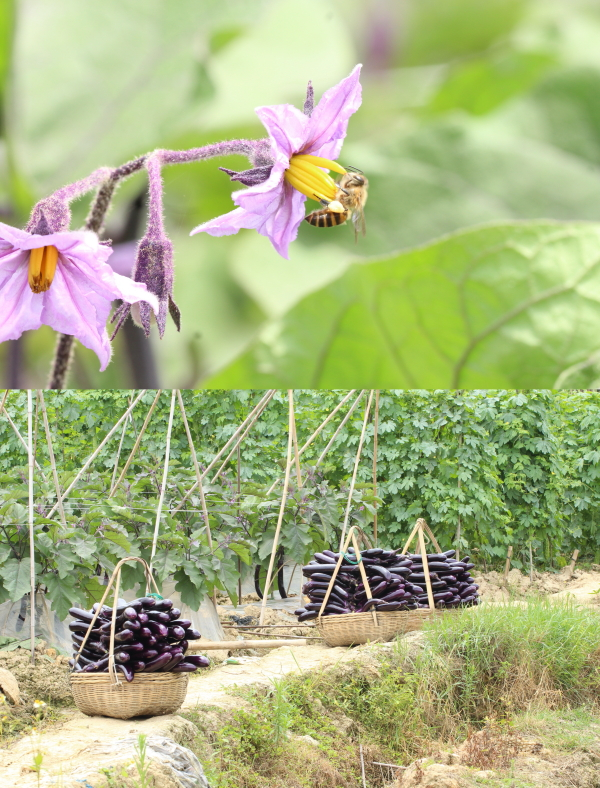

#### **IDP: INDEPENDENT DEVELOPMENT PLAN**

This is my IDP to reach my research targets and building towards my overall career and personal development goals. This will be reviewed regularly and update throughout my time in the TEELab.

###### TIMELINE, GOAL AND ACTION TO BE TAKEN 

(1). 3 to 4 years: Complete my PhD successfully within this timeframe 

(2). 3 year: Complete at least two manuscripts

(3). 2 year: Complete at least two manuscripts

(4). 1 year: Successfully complete my PhD qualifying examination

(5). 1 year: Become proficient in GIS

(6). 1 year: Explore more on Bayesian statistics, 

(7). 3 months to 1 year: Chapter 1A: Effects of animals on biomass removal
Q. Does animal removal or animal diversity affect ecosystem functioning?

(8). 3 to 6 months: Chapter 1B: Contrasting functional structure of dung beetle assemblages associated to different land-use types 

Aim 1. Studying underlying assembly mechanisms of dung beetle communities across different land-use types (i.e. logged forests, oil palm plantations and riparian areas) using both taxonomical (i.e. species richness and diversity) and functional diversity metrics (functional richness, evenness, divergence, redundancy) in multiple year sampling. Functional diversity metrics and their deviation from the predicted values will be measured by a null model approach.  

Aim 2. Studying of functional beta-diversity: test functional homogenization among the communities as a result of different land-use types across multiple sampling years. 

Aim 3. Studying dung removal and associated functional traits across land-use types. 
Complete three courses

### [TEELab: Tropical ECOLOGY & Entomology LAB](https://teelabntu.wixsite.com/home)

