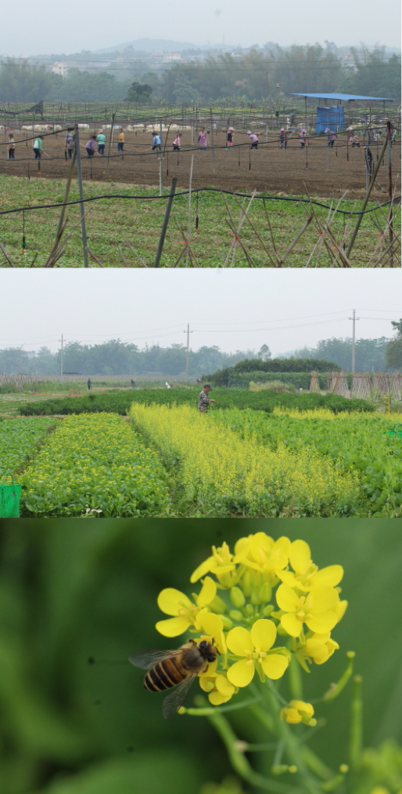

#### **IDP: INDEPENDENT DEVELOPMENT PLAN**

This is my IDP to reach my research targets and building towards my overall career and personal development goals. This will be reviewed regularly and update throughout my time in the TEELab.

###### TIMELINE, GOAL AND ACTION TO BE TAKEN 

(1). 3 to 5 years: Sustaining a research grant and running independent studies related to my PhD work 

- Learn how to write a compelling grant proposal

-	Read and research about the latest techniques in the field of agriculture biodiversity studies

(2). 1 year: Successfully complete the PhD qualifying examination

-	Draft a well-researched proposal 

-	Prepare for questions that may be asked about the study by reading and preparing references to cite 

(3). 1 year: Become proficient in GIS, Explore more on Bayesian statistics, and Explore Python

-	Take up NUS course related to GIS in ecological landscapes

-	Complete reading and practicing the books I bought 

-	Take an online course 

(4). 2 year: Complete at least two manuscripts

-	Agricultural risk review 

-	Analyzing the questionnaire survey data

(5). 3 months: Obtain approval for manuscript from AGEE

-	Read more references related to the manuscript to respond to the reviewer’s comments 

(6). 3 months: Draft a well-researched and thoroughly referenced PhD proposal, and Draft interview questions for PhD study’s questionnaire survey 

-	Continue reading articles related to the field to stay updated in the latest techniques 

-	Research methods to craft a meaningful and robust questionnaire

-	Reach out to contacts in this field (in Sri Lanka, China) to facilitate future data collection  

(7). 6 months: Submit functional diversity manuscript to a reputable journal (Journal of Applied Ecology or Functional Ecology) 

-	Read carefully all the co-authors’ concerns and edit the manuscript 

### [TEELab: Tropical ECOLOGY & Entomology LAB](https://teelabntu.wixsite.com/home)

